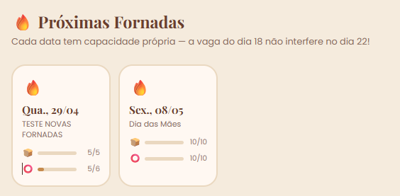

Data: 26/04 hora 5h34
Inciando testes e condisederações sobre o desenvolvimento do sistema. Transformei o testes em um feedback de instruções para o Arquiteto. Assim evito retrabalho e facilito a fixação de contexto do agente arquiteto v.3
Area admnistrativa
-Cadastro de fornadas
    - dev
      - <Arquiteto>
        <Tarefa>
        O Cadastro ocorre sem erros, mas não é possivel editar após inserido, qual o propósito de manter esse painel?
        
        </tarefa> <ojetivo>Apresentar estudo do o porque implementamos esse painel, qual dor ele resolve. Creio que aqiu há uma oportunidade<obejtivo>
-Catalogo de produtos
    --Feedback do cliente: 
        <Arquiteto> 
            <tarefa>
            Criar subcategoria de bolos: sem glútem, sem lactose. Cliente diz que facilida a orientação do cliente na página.
            </tarefa>
    -- Testes: 
        <Arquiteto>
            <tarefa>
            cadastro, edição e ativa/desativa validados pelo cliente
            </tarefa>
        </Arquiteto>
- Pedidos
    - dev
      - <Arquiteto> 
        - <tarefa> Não exibe para a artesã quem pediu, no momento ela só tem esse acompanhamento no zap, mas o zap é um alerta de produção solicitada, o sistema deve ser a orientação principal para a artesã. obs. isso já apareceia em versões anteriores. Valide
        -  Criar área de pedidos do cliente e que ele possa ter acesso ao seu histórico de compras no site. 
        - </tarefa> 
      - </Arquiteto>
      
      
- Graficos
    - dev:
      - idea: Criar ambiente de homologação para que o banco não fique com dados de testes <Arquiteto> 
        - <tarefa>
            valide, estude a viabilidade técnica e pontos positivos e negativos
        - </tarefa>
      - </Arquiteto>
- 
Painel da Artesã
    - dev:
      - <Arquiteto> 
        - <tarefa> Valide o painel da artesã diminiu a fila automaticamente quando o dia vira. Ex. pedido de pão do joão era dia 22.4, na fila de pão tinha 2 pedidos. Ao virar o dia a fila cai para 1, mas o produto foi entregue? Essa inconsistência pode dar uma falsa orientação a cozinha
        - </tarefa>
      - </Arquiteto> 
  Area do cliente
  Pedidos
      - Dev
      - <Arquiteto> Ainda é permitido pedir bolos sem a regra de 24 hora Veja:                
        - <mensagem> 
           Olá, Afeto em Forma! 🎂 Encomendar 1x Bolo de Fubá Cremoso para 2026-04-27.
          Nome: Douglas Teste
          WhatsApp: 12944253012
          Endereço: Rua dos Jacares, 152 
          </mensagem>
          <tarefa>validar em qual versão solicitamos essa correção e incluir no registro a hora que o pedido foi feito<tarefa>
<Arquiteto>

